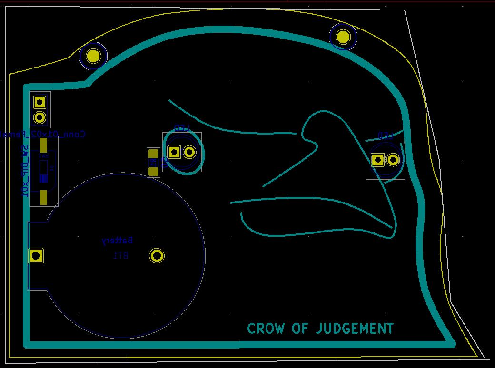
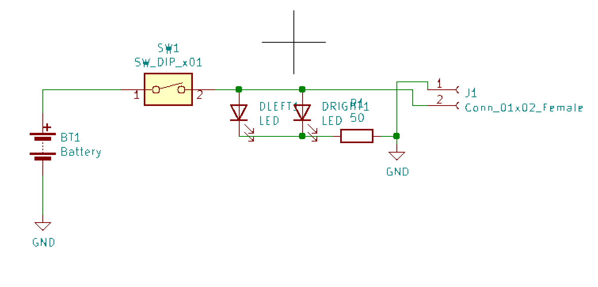
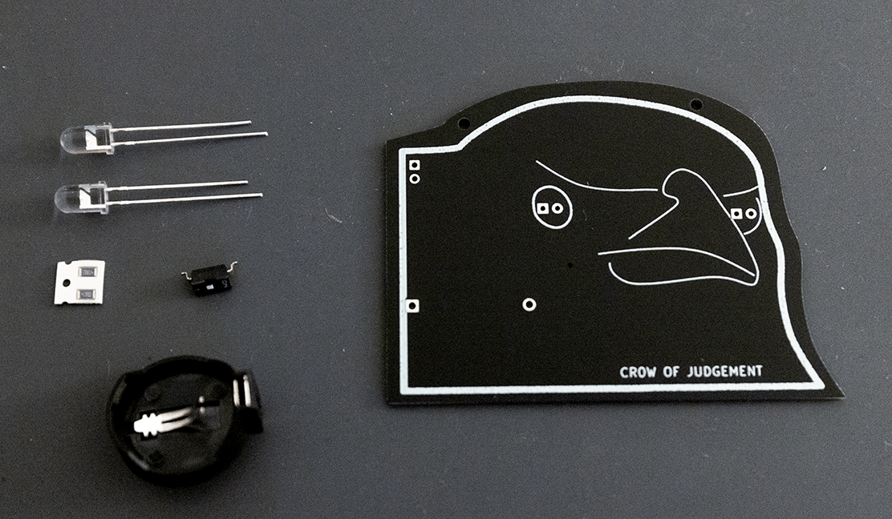
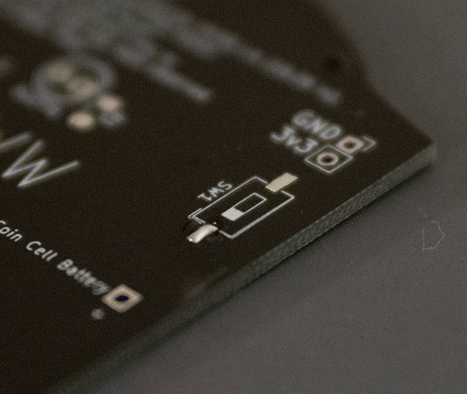
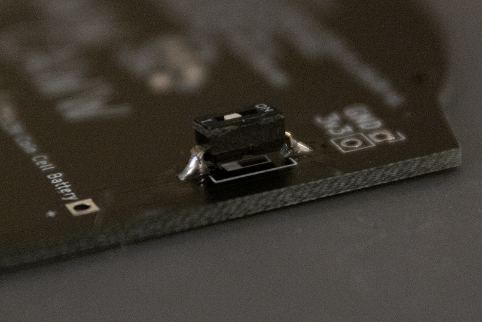
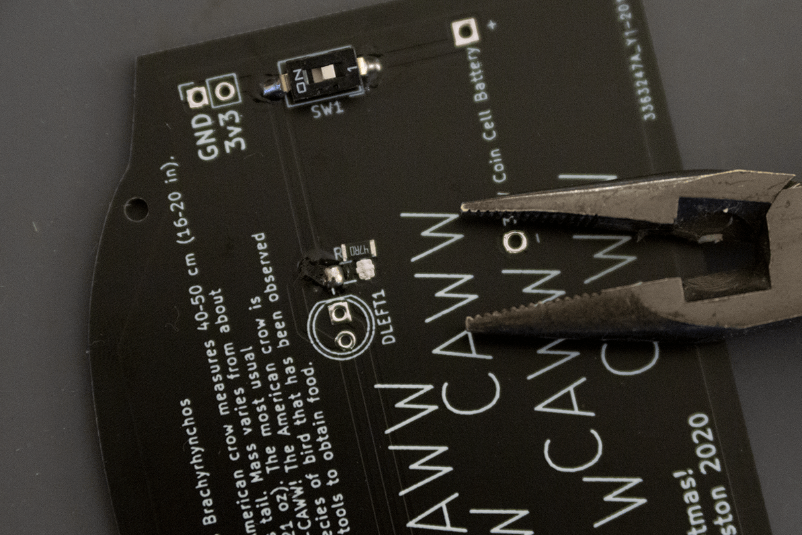
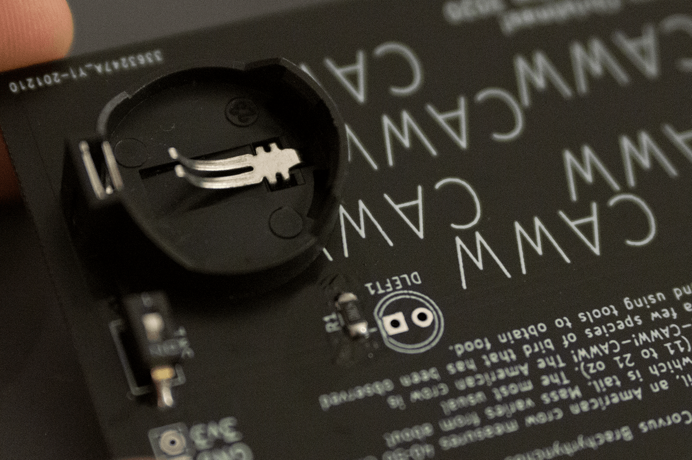
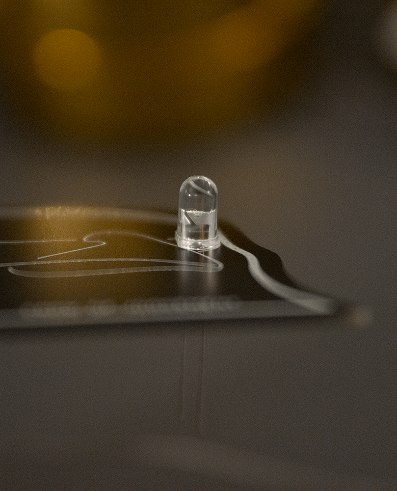

An LED Christmas ornament based on the "Crow of Judgement" meme.

# What?

# What, actually?

This is a meme which was common among my friends from school (aka "robocrob"). As a 
last-minute secret santa idea, I designed this circuitboard and made a few for gifts.

The circuit is really basic. It's just a switch, resistor, and two very bright red LEDs powered by a CR2032 coin cell battery.

I used KiCad to design the board. I traced the crow of judgement image
using Inkscape and the [svg2mod](https://github.com/svg2mod/svg2mod) tool to
convert my vector trace into the footprint.

I included pins on the board so that you can easily connect external power sources, if you want PWM or just don't want to use a battery.
The footprints for the parts are placed on the back, but the LEDs are meant
to go on the opposite side. This was done so that the silkscreen on the front
side was kept clean.

Because of the last minute nature of when I decided to start the project and
the amount of time it takes to have PCBs made (including in a pandemic),
I rushed the design of these by keeping them as simple as possible.
Maybe next year I could incorporate a microcontroller and make this more hackable. Only a few 4 AM nights were required to wrap this up.

# Build Guide

These are some basic instructions intended for those with some prior soldering experience
and some understanding of surface mount soldering, intended for those that I gifted
these ornaments to.

Also yes, I realize that many of these images are somewhat out of focus and
that my work surface was a bit dusty. No I don't plan on retaking these images.

## Parts

You should have:
  - The circuitboard
  - 2 LEDs (red)
  - 2 surface-mount resistors (40 ohm 1206 package, one extra)
  - 1 surface-mount switch
  - 1 coin-cell battery holder for a CR2032
  - 1 CR2032 battery
  - 1 piece of string to hang the ornament with

This page will provide some non-specific details for how to assemble the item.

## Tools Required

You'll need:
  - A soldering iron with a relatively fine tip
  - Solder
  - A room with good air circulation

Nice to have:
  - Diagonal cutters
  - Tweezers or pliers
  - Solder wick

# Assembly

## 1. Surface Mount Parts

The surface mount parts are the hardest part, luckily there aren't that many of them. It's good to get them out of the way first.
The challenge with these parts is that you have to keep them steady in the right place.

In general the technique I use is:
1. Tin one pad of the package very slightly.
2. Line up the package, ideally with tweezers or pliers.
3. With one hand heat the tinned pad and with the other hold the package in place.
4. Once the package is secure, solder the remaining pads. (In this case there are only 2.)

That's what I do here with the switch. I would actually recommend instead starting with the resistors, since I gave you 2, but the switch is
a bigger package so it will be easier.

Tin one pad for the component.

Place the part in place, hold it steady with the tweezers, heat up the pre-tinned side, then solder the other side.
The switch is not directional, so it can go either way. Neither are the resistors.

The switch should stand up a little bit. Unfortunately the part I picked kinda sucks. It sticks out from the board, and the switch is flush in the casing.
You will need a screwdriver or a pencil to flip the switch back and forth.

Next, I soldered the resistor. They are not directional, so don't worry if the numbers don't add up.
I provided 2 because they are very tiny and easy to lose.

If it turns out that the pads have too much solder, that's why solder wick is handy.

Congrats! That's the hard part!

## 2. Through-Hole Parts

Next up are the through-hole parts. If you know how to solder, you know how to solder these. If you don't for some reason, there are many guides or you can just DM me.

Both of these parts are directional. If you mess up everything completely in reverse, it will probably still work, but if any less then it won't work.

Start with the battery holder.

The square side of the battery holder goes on the **+** end, facing outwards on the **back** of the board. Place the board down on the battery holder and solder the two pins.

The battery holder pins are very sharp, and are in an area where you might place your hand! Be sure to trim the pins off when you are done so they aren't so sharp!

_This goes without saying, but you are also probably soldering with lead. Please don't lick the board, because lead isn't good for you._

All that's left are the LEDs.

You will probably know this already, but it's good to double check. LEDs have a flat edge on one side, one leg which is shorter, and you can also check what the inside of the LED looks like. **Match up the short leg (-) with the square hole (also labelled - on the back)!**

When soldering the LEDs, you may want to bend the pins a bit so that the LED stays in place. Even when pulled tight, it will have a small amount of wiggle room for adjustment. Be sure to trim these pins as well.

_Note:_ If the switch turns out to be really bad, you could probably use one leg of the LEDs to jump the two pins for the switch in its place. This will leave things permanently on.

## 3. Insert Battery + Hang with String

That's it! All that's left is to insert the battery. It should go in only one way, with the positive end of the battery facing outwards.

The holes in the top of the board can be used to thread twine through, with knots in the back to hold it in place.

# Some Things You Should Know

- The holes in the top are meant to run thread through to hang it up as an ornament. This is not pictured in the photos seen here, because I didn't have the thread yet.

- The power switch kinda sucks because I didn't get the right part. You'll want to use something to flip the switch.

- The LEDs are super bright, I have not done the math for how long it will stay on. I doubt it will be very long. Turn it off when you are done, or prepare some extra CR2032 batteries.

- The 3v3 and GND pins in the corner are meant to be an external power source. Want to hook this up to an Arduino? Go ahead!